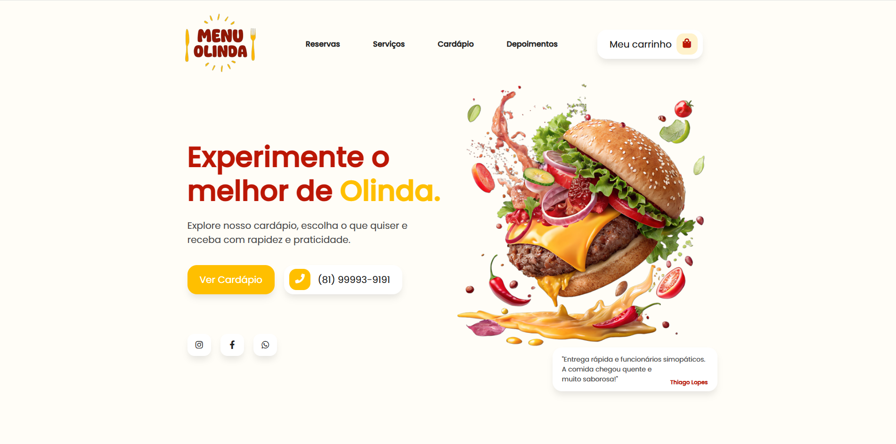

# Menu_Olinda

O Sistema de Cardápio e Pedido Online é um front-end funcional para restaurantes e lanchonetes, permitindo que os clientes façam pedidos diretamente via WhatsApp, com carrinho dinâmico, etapas de pedido e busca automática de endereço via CEP.

# Funcionalidades

- **Cardápio Dinâmico:** Filtragem por categorias, botão “Ver Mais” e renderização de produtos via template HTML.
- **Carrinho de Compras:** Adicionar, remover ou alterar quantidade de itens; badge total atualiza automaticamente; modal com etapas do pedido.
- **Etapas do Pedido:**
        Visualização do carrinho.
        Inserção de endereço com validação e busca via ViaCEP API.
        Resumo do pedido com total e endereço, pronto para envio via WhatsApp.
- **Envio de Pedido via WhatsApp:** Gera link com itens, quantidade, endereço e valor total do pedido, pronto para envio direto ao restaurante.
- **Mensagens e Feedback:** Toasts animados indicam erros ou confirmações de ações.
- **Layout Responsivo:** Adaptado para dispositivos mobile, tablet e desktop.

# Tecnologias Utilizadas

- **HTML5:** Estrutura semântica do site.
- **CSS3:** Estilos responsivos e identidade visual do cardápio.
- **JavaScript (ES6+) & jQuery:** Manipulação do DOM, eventos e templates dinâmicos.
- **ViaCEP API:** Busca automática de endereço a partir do CEP.
- **Font Awesome 5 Free:** Ícones de telefone, WhatsApp e carrinho.

# Demonstração

# Como executar o projeto

- **Clone este repositório:**

git clone https://github.com/SEU_USUARIO/cardapio-online.git

        Abra o arquivo index.html no navegador.
        Navegue pelo cardápio e adicione produtos ao carrinho.
        Abra o carrinho, preencha o endereço ou utilize a busca via CEP.
        Visualize o resumo do pedido e clique no botão do **WhatsApp** para enviar.

